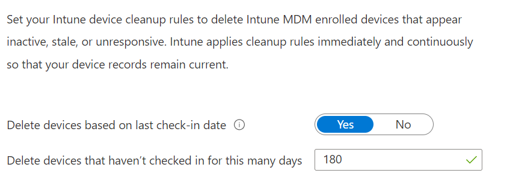

To configure the device clean up:

1.  Sign in to the [Endpoint Manager portal](https://endpoint.microsoft.com/)
    
2.  Go to **Devices => Device clean-up rules**
    
3.  Configure:
    
    *   Delete devices based on last check-in date: **Yes**
        
    *   Delete devices that haven’t checked in for this many days: **180**
        

