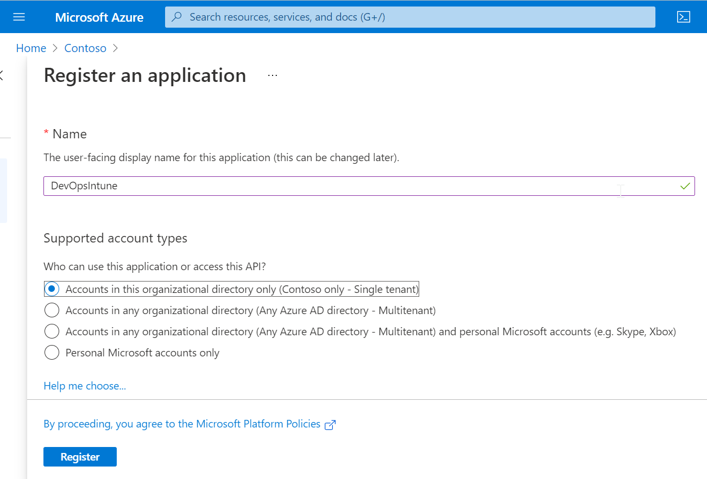
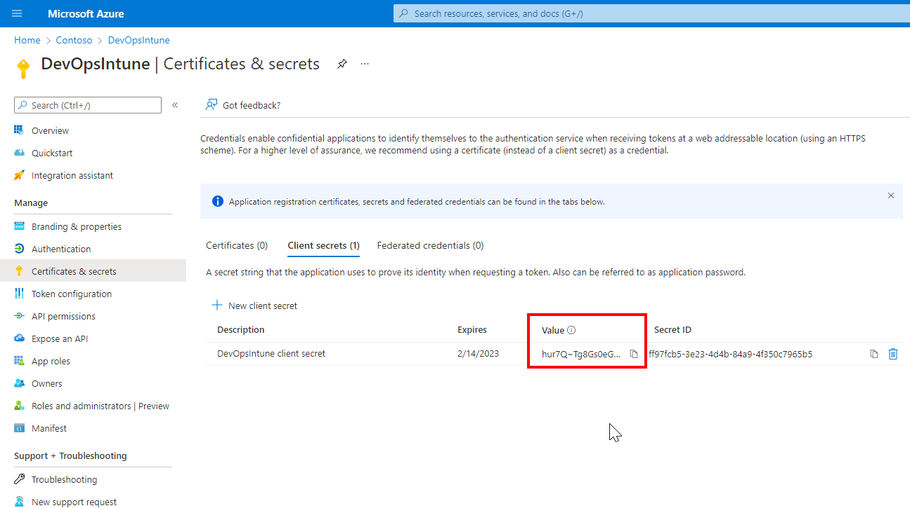
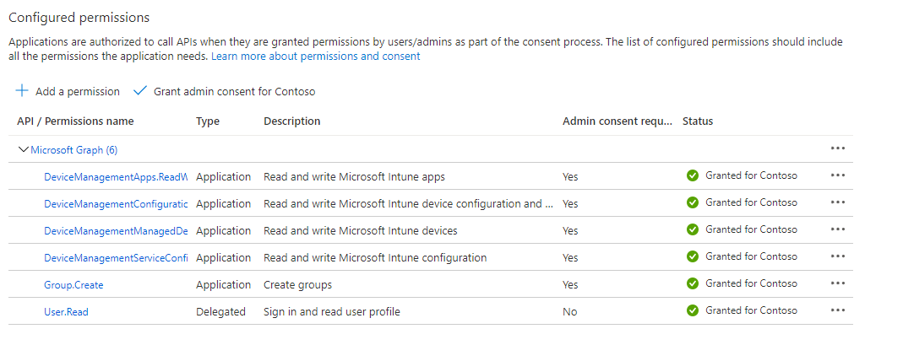
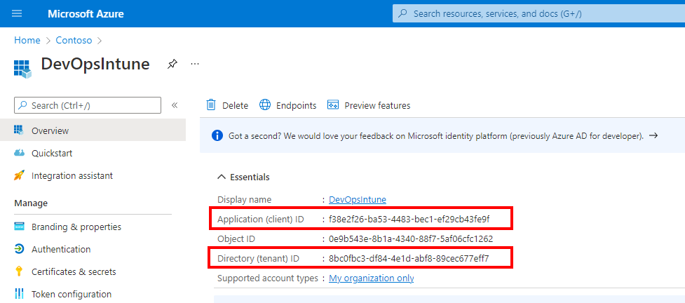

Add App registration
--------------------

*   Sign in to [https://portal.azure.com](https://portal.azure.com)
    
*   Open **Azure Active Directory**
    
*   Click **App registration**
    
*   Click **New registration**
    
*   Type a name for the app registration (for example DevOpsIntune)
    
*   Select: **Accounts in this organizational directory only (Single tenant)**
    
*   Click **Register**
    

Add secret
----------

*   Click **Certificates & secrets**
    
*   On the **Client Secrets** tab, click **\+ New client secret**
    
*   Type a description
    
*   Select the expiration
    
*   Click **Add**
    
*   **Important:** Save the secret Value (Secret ID).
    

API Permissions
---------------

*   Click API Permissions
    
*   Click **Add a permission**
    
*   Select **Microsoft Graph**
    
*   Select **Application permissions**
    
*   Add DeviceManagementApps.ReadWrite.All
    
*   Add DeviceManagementConfiguration.ReadWrite.all
    
*   Add DeviceManagementManagedDevices.ReadWrite.All
    
*   Add DeviceManagementServiceConfig.ReadWrite.All
    
*   Add Group.Create
    
*   Click **Add permissions**
    
*   Click **Grant admin consent for \[tenant name\]**
    
*   Click Yes
    

Get the Application (client)ID, Directory (tenant) ID:
------------------------------------------------------

*   Click on **Overview**
    
*   Save the Application (client) ID and Directory (tenant) ID:
    

