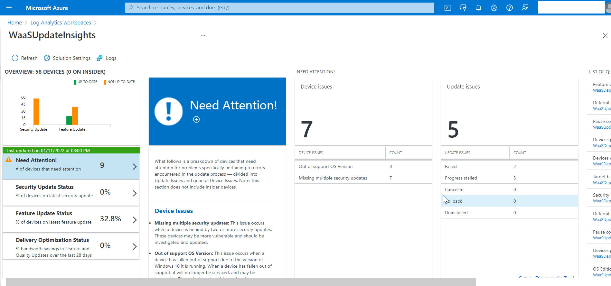

With Azure log analytics update compliance you can:

*   Monitor security, quality, and feature updates for Windows 10 or Windows 11 (professional, education or enterprise editions only)
    
*   View a report of device and update issues related to compliance that need attention.
    
*   Check bandwidth savings incurred across multiple content types by using Delivery Optimization.
    

Update Compliance must be configured through the Azure portal and no costs will be charged when using Azure log Update Compliance.

Update Compliance uses Windows client diagnostic data for all the reporting. Update compliance collects system data including:

*   Update deployment progress,
    
*   Windows Update for Business configuration data
    
*   Delivery Optimization usage data
    

The collected data will be send to the configured Azure Log Analytics workspace.

<table data-layout="default" data-local-id="42a408eb-d7ea-4a09-96ce-d6c63dc82c95" class="confluenceTable"><colgroup><col style="width: 80.0px;"><col style="width: 307.0px;"><col style="width: 372.0px;"></colgroup><tbody><tr><th class="confluenceTh">
<strong>#</strong>
</th><th class="confluenceTh">
<strong>Decision</strong>
</th><th class="confluenceTh">
<strong>Justification</strong>
</th></tr><tr><td class="confluenceTd">

</td><td class="confluenceTd">
Windows devices will be enrolled in Windows Log Analytics Update Compliance
</td><td class="confluenceTd">
To monitor the Windows update and the delivery optimization, devices will be added to a update compliance portal.
</td></tr></tbody></table>