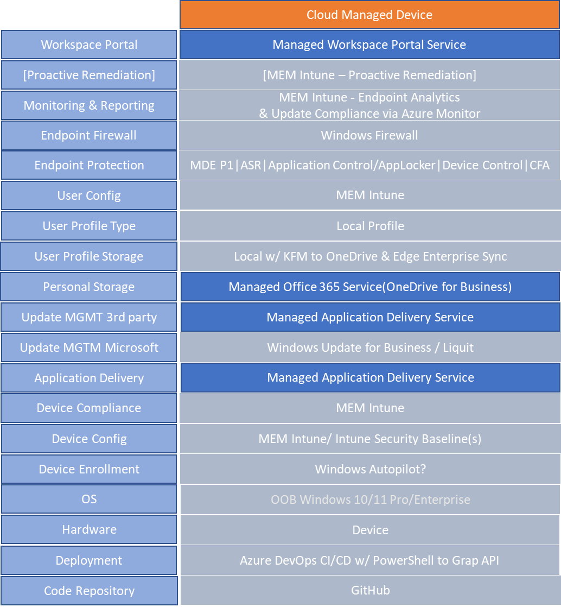

*   
    
    MDE = Microsoft Defender for Endpoints
    
*   ASR = Attack Surface Reduction
    
*   CFA = Controlled Folder Access
    

Windows 10 Microsoft Security Basline 21H2
------------------------------------------

[https://techcommunity.microsoft.com/t5/microsoft-security-baselines/security-baseline-for-windows-10-version-21h2/ba-p/3042703](https://techcommunity.microsoft.com/t5/microsoft-security-baselines/security-baseline-for-windows-10-version-21h2/ba-p/3042703)

Windows 11 Support
------------------

