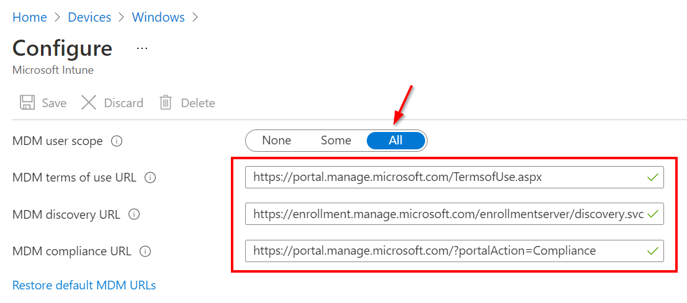

To configure Intune Device Enrollment:

1.  Sign in to the [Endpoint Manager portal](https://endpoint.microsoft.com)
    
2.  Go to **Devices => Windows => Windows enrollment => Automatic Enrollment**
    
3.  Set MDM user scope to **All**
    
4.  Set the following URL’s:
    
    *   MDM terms of use URL: [https://portal.manage.microsoft.com/TermsofUse.aspx](https://portal.manage.microsoft.com/TermsofUse.aspx)
        
    *   MDM discovery URL: [https://enrollment.manage.microsoft.com/enrollmentserver/discovery.svc](https://enrollment.manage.microsoft.com/enrollmentserver/discovery.svc)
        
    *   MDM compliance URL: [https://portal.manage.microsoft.com/?portalAction=Compliance](https://portal.manage.microsoft.com/?portalAction=Compliance)
        

Example:
--------

