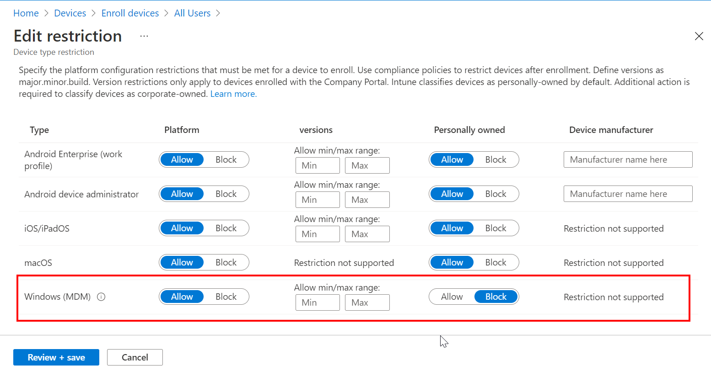
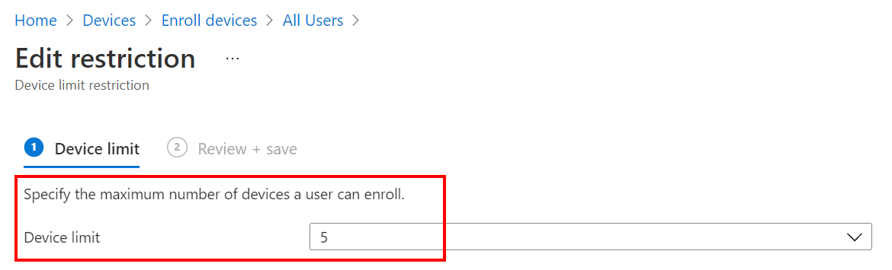

Intune is a Cloud management suite which is capable of managing multiple platforms. With enrollment restriction, you can allow enrollment per platform. You only need to block platforms your organization does not support or are not ready to be managed via Intune. Allowed platforms can be configured with additional enrollment restrictions.

Step 1: Configure platform restrictions:
----------------------------------------

1.  Sign in to the [Endpoint Manager portal](https://endpoint.microsoft.com/)
    
2.  Go to **Devices => Enroll devices => Enrollment restrictions**
    
3.  Click on **All Users (**default profile) at Device type restrictions
    
4.  Click on **Properties**
    
5.  After the platform settings, click on **Edit**.
    
6.  Set the **Windows MDM** platform to **Allow** and the Personally owned to **Block.** This will only allow corporate device enrollment with Windows Autopilot. Manually Windows enrollment will be blocked.
    
7.  Click on **Save**.
    

Step 2: Configure device limit restrictions
-------------------------------------------

1.  Sign in to the [Endpoint Manager portal](https://endpoint.microsoft.com/)
    
2.  Go to **Devices => Enroll devices => Enrollment restrictions**
    
3.  Click on **All Users (**default profile) at Device limit restrictions
    
4.  Click on **Properties**
    
5.  After the Device limit, click on **Edit**.
    
6.  Set the maminum device limit (default = 15)
    
7.  Click on **Save**
    

