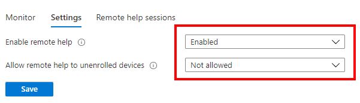

1.  Sign in to [Microsoft Endpoint Manager admin center](https://go.microsoft.com/fwlink/?linkid=2109431) 
    
2.  Go to **Tenant administration** > **Connectors and tokens** > **Remote help (preview)**.
    
    1.  On the **Settings** tab **enable remote Help.**
        
    2.  Set the **Allow remote help to unenrolled devices** to **Disabled.**
        
3.  Select **Save**.
    

