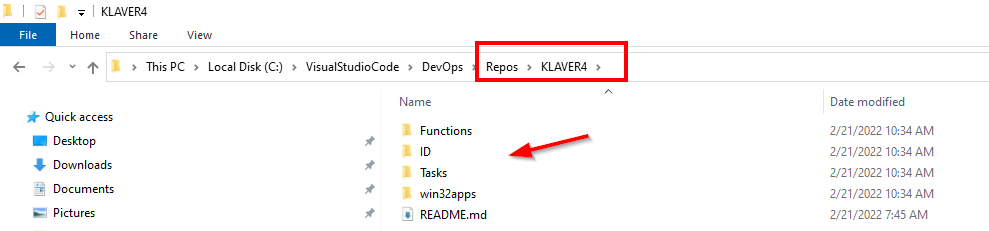
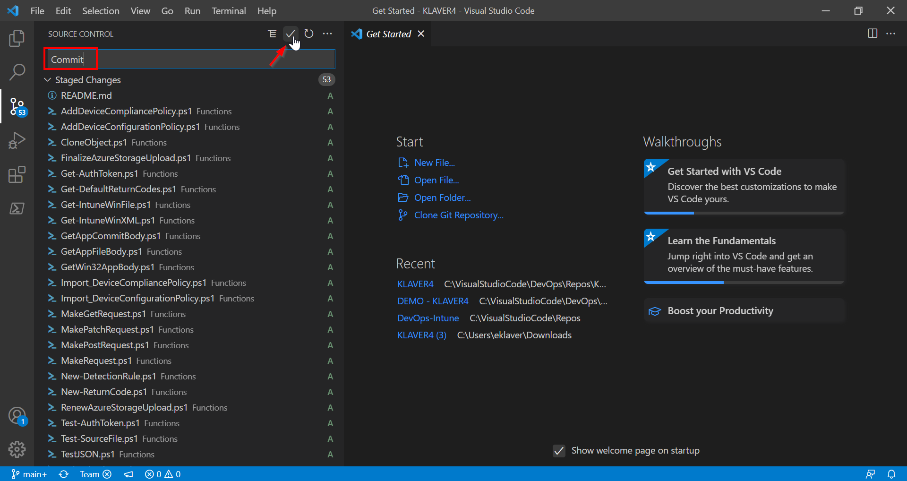

*   Unzip the Repos files
    
*   Copy the unzipped files to the local repository location (for example
    

*   Open Visual Studio Code
    
*   The files should be visible in Visual Studio Code
    
*   Click on **Source Control** in the left panel
    
*   Click on the **\+** (Stage all Changes)
    
*   Type Commit and click the Agree button
    

*   Click the **Sync Changes** button
    
*   Click **OK**.
    
*   The Repo files are synced to the DevOps project.