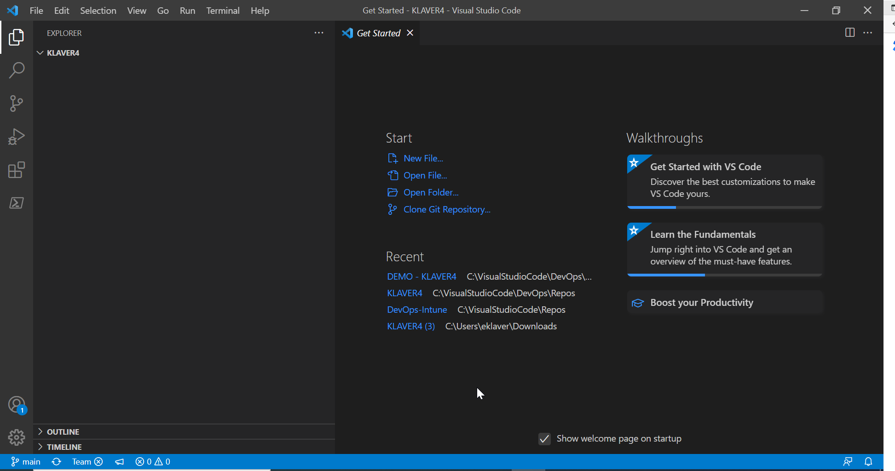

Requirements:
-------------

*   Download Visual Studio Code ([https://code.visualstudio.com/#alt-downloads](https://code.visualstudio.com/#alt-downloads))
    
*   Install Visual Studio Code on your local computer
    
*   [https://git-scm.com/download/win](https://git-scm.com/download/win)
    

For this task you will need an empty DevOps project:
----------------------------------------------------

*   Open [https://dev.azure.com/](https://dev.azure.com/dwswanalytics/)
    
*   Click on your organization
    
*   Click on your DevOps project
    
*   Click en **Repos**
    
*   Click on **Clone**
    
*   Click on **Clone in VS Code**
    
*   Click on Open
    
*   Visual Studio Code will start, and click on **Open**
    
*   Select an empty local repository location (for example C:\\VisualStudioCode\\DevOps\\Repos folder)
    
*   After creating the local folder, click **Open**
    

An empty Visual Studio Project opened on your local computer

