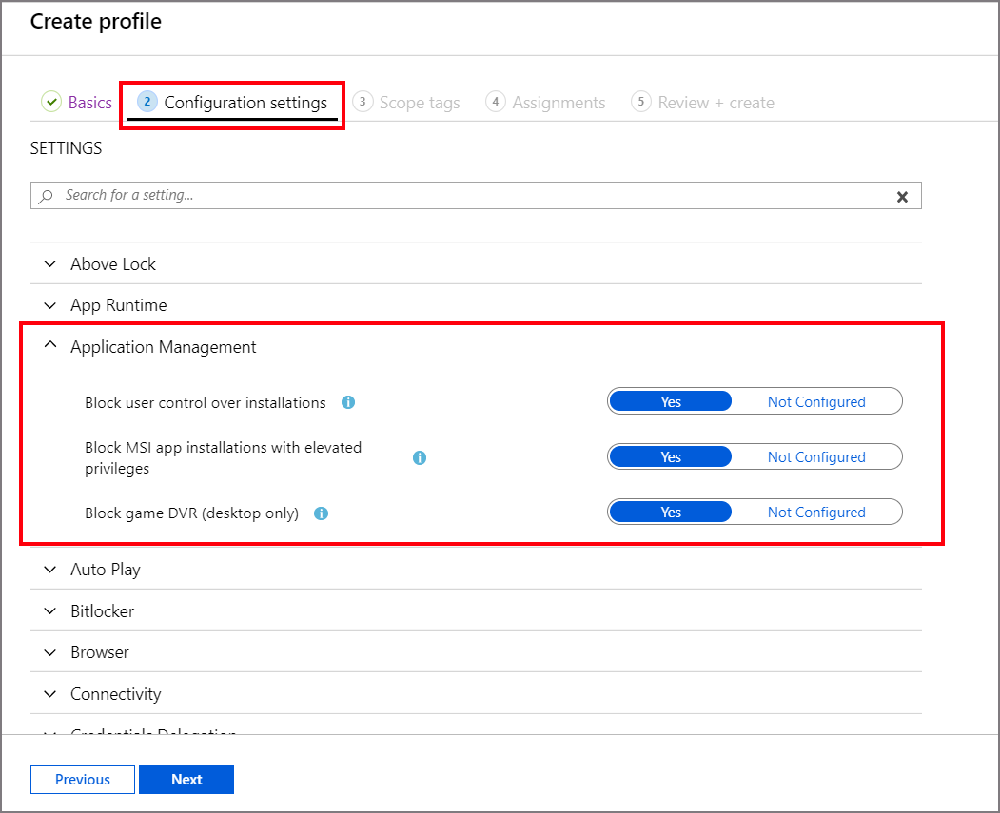

1.  Sign in to the [Microsoft Endpoint Manager admin center](https://go.microsoft.com/fwlink/?linkid=2109431).
    
2.  Select **Endpoint security** > **Security baselines** to view the list of available baselines.
    
3.  Select the baseline you'd like to use, and then select **Create profile**.
    
4.  On the **Basics** tab, specify the following properties:
    
    *   **Name**: Enter a name for your security baselines profile.
        
    *   **Description**: Enter some text that describes what this baseline does. The description is for you to enter any text you want. It's optional, but recommended.
        
    
    Select **Next** to go to the next tab. After you advanced to a new tab, you can select the tab name to return to a previously viewed tab.
    
5.  On the Configuration settings tab, view the groups of **Settings** that are available in the baseline you selected. You can expand a group to view the settings in that group, and the default values for those settings in the baseline. To find specific settings:
    
    *   Select a group to expand and review the available settings.
        
    *   Use the _Search_ bar and specify keywords that filter the view to display only those groups that contain your search criteria.
        
    
    Each setting in a baseline has a default configuration for that baseline version. Reconfigure the default settings to meet your business needs. Different baselines might contain the same setting, and use different default values for the setting, depending on the intent of the baseline.
    
    
6.  If done, Click **Next**
    
7.  Click **Next**
    
8.  Click **Create.**
    
9.  After you create a profile, edit it by going to **Endpoint security** > **Security baselines**, select the baseline type that you configured, and then select **Profiles**. Select the profile from the list of available profiles, and then select **Properties**. You can edit settings from all the available configuration tabs, and select **Review + save** to commit your changes.