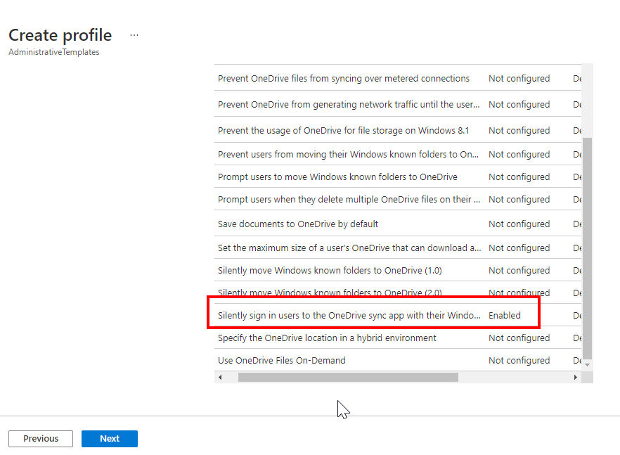

1.  Sign in to the [Microsoft Endpoint Manager admin center](https://go.microsoft.com/fwlink/?linkid=2109431).
    
2.  Select **Devices** > **Configuration profiles** > **Create profile**.
    
3.  Enter the following properties:
    
    *   **Platform**: Select **Windows 10 and later**.
        
    *   **Profile**: To use a logical grouping of settings, select **Templates** > **Administrative Templates**. To see all the settings, select **Settings catalog**.
        
4.  Select **Create**.
    
5.  In **Basics**, enter the following properties:
    
    *   **Name**: Enter a descriptive name for the profile according the company naming convention
        
    *   **Description**: Enter a description for the profile. This setting is optional, but recommended.
        
6.  Select **Next**.
    
7.  In **Configuration settings**, select **All settings** to see an alphabetical list of all the settings. Or, configure settings that apply to devices (**Computer configuration**), and settings that apply to users **(User configuration**)
    
8.  When you select **All settings**, every setting is listed. Scroll down to use the before and next arrows to see more settings:
    
9.  Select any setting. For example, filter on **OneDrive**, and select **Silently sign in users to the OneDrive sync app with their Windows credentials**. A detailed description of the setting is shown. Choose **Enabled**, **Disabled**, or leave the setting as **Not configured** (default). The detailed description also explains what happens when you choose **Enabled**, **Disabled**, or **Not configured**.
    
10.  When you select **Computer configuration** or **User configuration**, the setting categories are shown. You can select any category to see the available settings.
    
11.  Select **OK** to save your changes.
    
12.  Select **Next**.
    
13.  Select **Next**.
    
14.  Select **Next**.
    
15.  Select **Create**.
    

Example:

