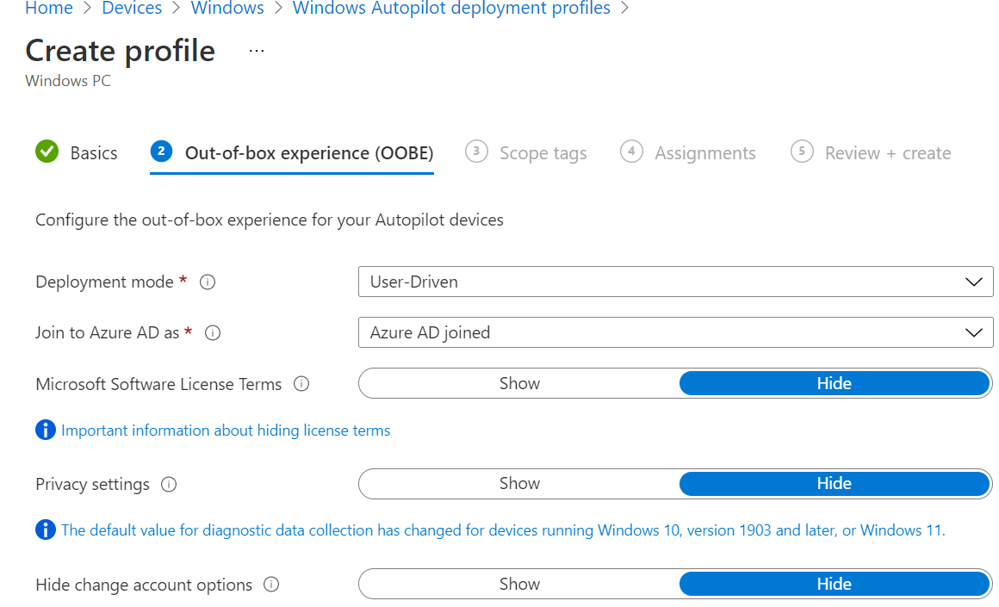
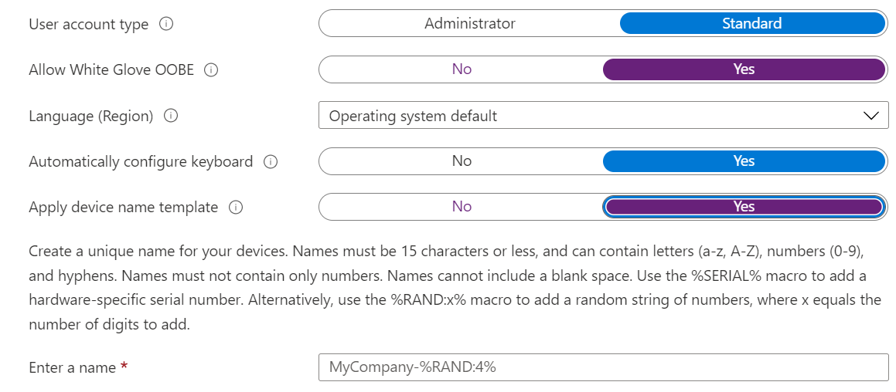

To create a Windows autopilot profile:

1.  Sign in to the [Endpoint Manager portal](https://endpoint.microsoft.com/)
    
2.  Go to **Devices => Windows => Windows enrollment => Windows Autopilot deployment profiles**
    
3.  Click on **Create profile**
    
4.  Select **Windows PC**
    
5.  Type a profile name (required) and description (optional)
    
6.  Select **Convert all target devices to Autopilot** to **Yes**
    
7.  Click **Next**
    
8.  In the Out-of-box-experience (OOBE) select:
    
    *   Deployment mode: **User-Driven**
        
    *   Join to Azure AD as: **Azure AD joined**
        
    *   Microsoft Software License Terms: **Hide**
        
    *   Privacy settings: **Hide**
        
    *   User account type: **Standard**
        
    *   Allow White Glove OOBE: **Yes**
        
    *   Language (Region): **Operating system default**
        
    *   Automatically configure keyboard: **No**
        
    *   Apply device name template: **Yes**
        
    *   Enter a name: **\[variable\]-%RAND:5%**
        
9.  Click **Next**.
    
10.  In the Scope tags, click **Next**.
    
11.  On the Assignments, click **Next**.
    
12.  Click on **Create**
    

