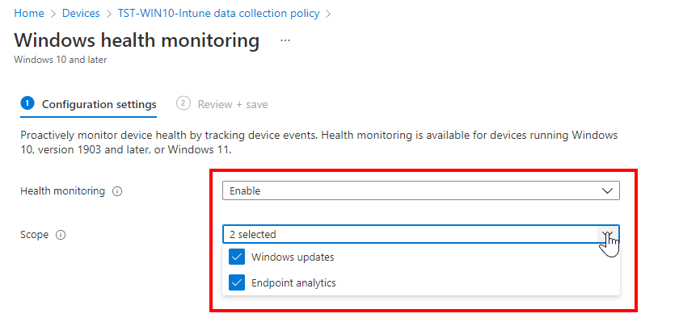

1.  Sign in to the [Microsoft Endpoint Manager admin center](https://go.microsoft.com/fwlink/?linkid=2109431).
    
2.  Select **Devices** > **Configuration profiles** > **Create profile**.
    
3.  Enter the following properties:
    
    *   **Platform**: Choose **Windows 10 and later**.
        
    *   **Profile**: Select **Templates** > **Windows health monitoring**
        
4.  Select **Create**.
    
5.  In **Basics**, enter the following properties:
    
    *   **Name**: Enter a name for the profile.
        
    *   **Description**: Enter a description for the profile. This setting is optional, but recommended.
        
6.  Select **Next**.
    
7.  In **Configuration settings**, configure the following settings:
    
    *   **Health monitoring**: Select **Enable**
        
    *   **Scope**: Select:
        
        *   **Windows updates**: This option configures devices to send Windows Update data to Intune. This data is then used in a [compliance policy](https://docs.microsoft.com/en-us/mem/intune/protect/windows-update-compliance-reports) that reports on Windows updates.
            
        *   **Endpoint analytics**
            
8.  Select **Next**.
    
9.  Select **Next**.
    
10.  Select **Next**.
    
11.  Select **Next**.
    
12.  Select **Create**,
    

