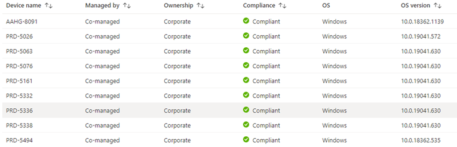

The compliance policy for devices contains rules that can check if the device is configured according to the company compliance policy. A compliance policy cannot enforce rules or settings, a configuration baseline must be set to change settings.

These compliance rules need to be configured into the Microsoft Intune portal and assigned to a group of users. It is possible to configure multiple compliance baselines for users’ groups. We highly recommended to decrease the number of compliance policies per platform.

A configuration policy contains six categories:

*   Custom Compliance
    
*   Device health
    
*   Device properties
    
*   Configuration Manager Compliance
    
*   System security
    
*   Microsoft Defender for Endpoint (plan 1 & plan 2)
    

An example of rules and configuration that can be set:

*   Require using a password for unlocking a device.
    
*   Require an encrypted device.
    
*   Require an original operating system of the vendor. (Jailbroken)
    
*   The requirement for a minimum version of the Operating System.
    
*   Require that the device machine risk score is not medium or high.
    

The IT administrator can easily see which devices are compliant and which are not. Devices that are not compliant can cause security risks. An option is available to  inform users that their device is not compliant by sending the user an e-mail. When a device is not compliant, access is limited to corporate resources. Details information about compliance information for a device can be recognized into the Intune Company portal.

<table data-layout="default" data-local-id="42a408eb-d7ea-4a09-96ce-d6c63dc82c95" class="confluenceTable"><colgroup><col style="width: 80.0px;"><col style="width: 302.0px;"><col style="width: 378.0px;"></colgroup><tbody><tr><th class="confluenceTh">
<strong>#</strong>
</th><th class="confluenceTh">
<strong>Decision</strong>
</th><th class="confluenceTh">
<strong>Justification</strong>
</th></tr><tr><td class="confluenceTd">

</td><td class="confluenceTd">
All Windows devices must comply to at least one compliance rule.
</td><td class="confluenceTd">
Windows devices must comply to the security measures of the company.
</td></tr><tr><td class="confluenceTd">

</td><td class="confluenceTd">
Windows devices will become non-compliant after one day if they do not comply to the security measures of the company. If the status of a Windows device will change from compliant to non-compliant, the status of the device will change to in-grace for a period of one day.
</td><td class="confluenceTd">
If a Windows device is compliant (or temporary in-grace), company resources can be reached. If a device is not compliant, company resources cannot be reached based on the Conditional Access rules. The device must first comply to the compliance policy and become compliant again to gain access to the company resources.
</td></tr><tr><td class="confluenceTd">

</td><td class="confluenceTd">
An e-mail will be sent to the user if the device gets non-compliant.
</td><td class="confluenceTd">
Users will be informed when the device is non-compliant, The user can take action to become compliant again and get access to the company resources.
</td></tr></tbody></table>