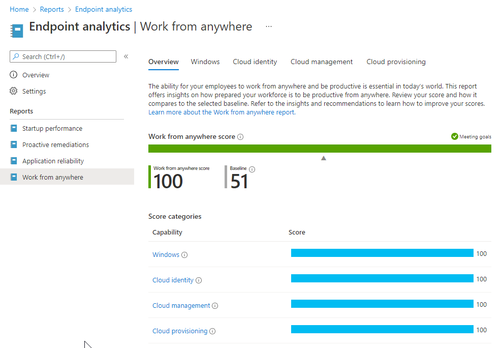

Endpoint analytics can help identify policies or hardware issues that may be slowing down devices. With Endpoint Analytics it is possible to proactively make improvements or automatically correct settings when settings are changed.

Policy and hardware Issues may be related to:

*   Legacy hardware
    
*   Software configurations that aren't optimized for the end-user experience
    
*   Issues caused by configuration changes and updates
    

Endpoint analytics aims to improve user productivity and reduce IT support costs by providing insights into the user experience.

To enroll devices to Endpoint analytics, they need to send required functional data to Microsoft public cloud. Endpoint Analytics uses the Windows Connected User Experiences and Telemetry component (DiagTrack) to collect the data from Intune-managed devices. 

<table data-layout="default" data-local-id="42a408eb-d7ea-4a09-96ce-d6c63dc82c95" class="confluenceTable"><colgroup><col style="width: 80.0px;"><col style="width: 307.0px;"><col style="width: 372.0px;"></colgroup><tbody><tr><th class="confluenceTh">
<strong>#</strong>
</th><th class="confluenceTh">
<strong>Decision</strong>
</th><th class="confluenceTh">
<strong>Justification</strong>
</th></tr><tr><td class="confluenceTd">

</td><td class="confluenceTd">
The Connected User Experiences and Telemetry&nbsp;service must run on the device.
</td><td class="confluenceTd">
To collect data, the Connected User Experiences and Telemetry&nbsp;service must be running on the device.
</td></tr><tr><td class="confluenceTd">

</td><td class="confluenceTd">
To collect Endpoint Analytics information, a Windows health monitoring configuration template will be applied on all Windows devices.
</td><td class="confluenceTd">
To collect the Endpoint Analytics information, the intune Windows health monitoring configuration template must apply to the Windows devices. If not applied, no Endpoint Analytics information will be available.
</td></tr><tr><td class="confluenceTd">

</td><td class="confluenceTd">
To use proactive remediation, a Windows E3/E5 or Microsoft 365 E3/E5 is required.
</td><td class="confluenceTd">
To make use of the proactive remediation scripts, a Windows 10 or Microsoft 365 E3/E5 is required. Without this license, you are not allowed to use the proactive remediation section in Intune.
</td></tr></tbody></table>