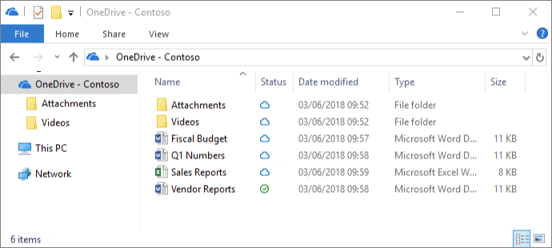

OneDrive Files On-Demand enables users to view, search for, and interact with files stored in OneDrive from within File Explorer without downloading them all to their device. The feature provides a seamless look and feel for both OneDrive and local files without taking up space on the local hard drive. Files that have not been downloaded have a cloud icon for their status, as shown below. For those files that have been downloaded, the status shows a green checkmark.

Natively, files will be downloaded only when you need to access them. However, if you plan to access a file while disconnected from the internet, you can make the file available offline by right-clicking it, and then selecting **Always keep on this device**. Alternatively, if you want to free space on your device and remove the downloaded copy of a file, right-click the file, and then select **Free up space**.