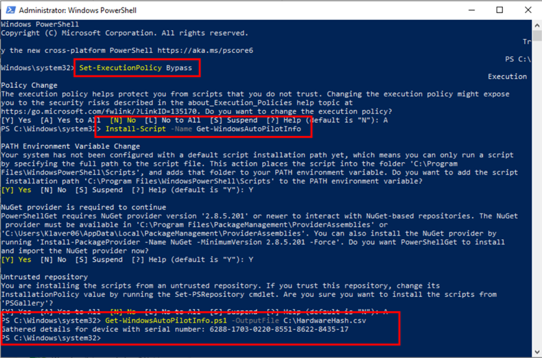
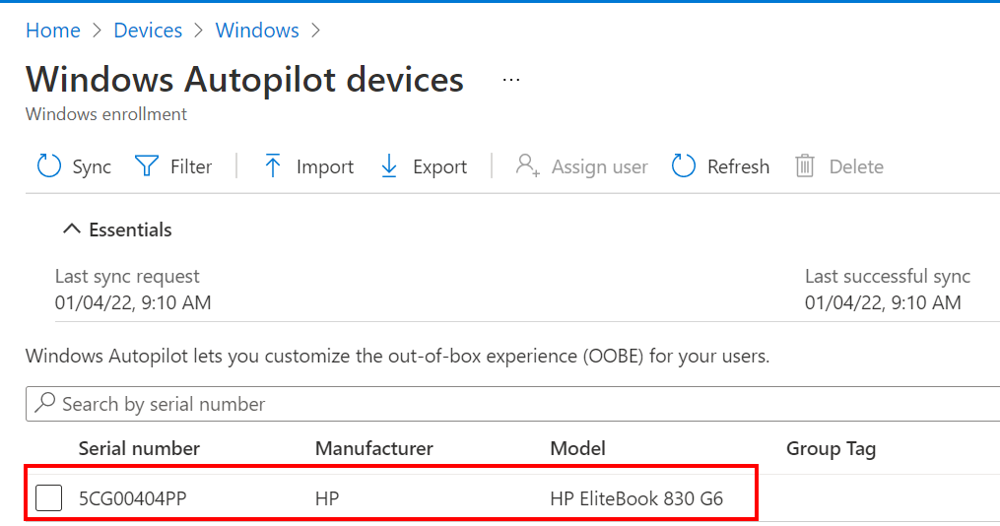

Step 1: create a device hardware hash
-------------------------------------

1.  On the Windows device open a powershell (admin) console
    
2.  Type: **Set-ExecutionPolicy Bypass**
    
3.  Type: **Install-Script -Name Get-WindowsAutopilotInfo**
    
4.  Type: **Get-WindowsAutoPilotInfo.ps1 -OutputFile \[path\]\\\[name\].csv**
    

Step 2: Import the Windows Autopilot hash:
------------------------------------------

1.  Sign in to the [Endpoint Manager portal](https://endpoint.microsoft.com/)
    
2.  Go to **Devices => Windows => Windows enrollment => Devices**
    
3.  Click on **Import**
    
4.  Select the csv file
    
5.  Click on **Import**
    

