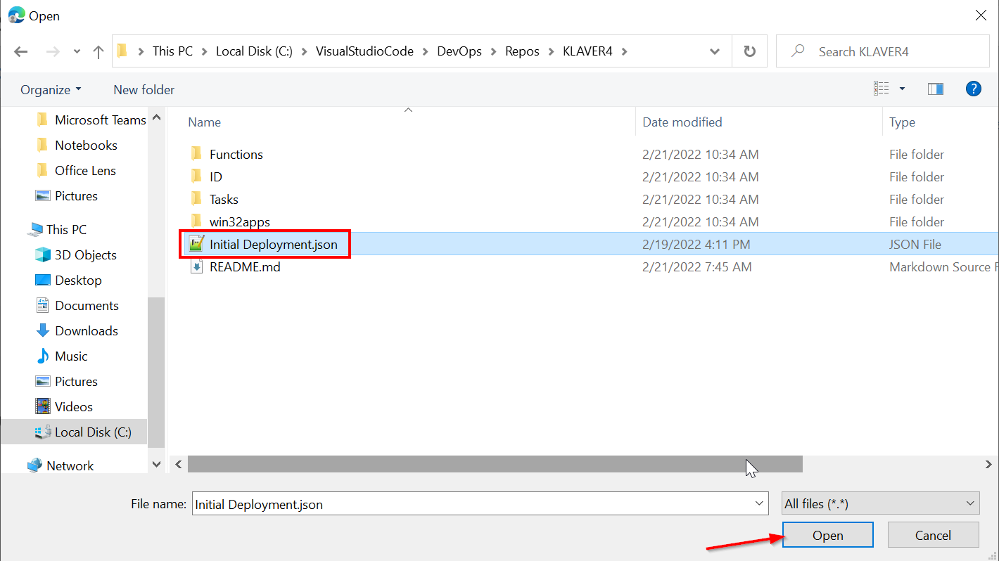
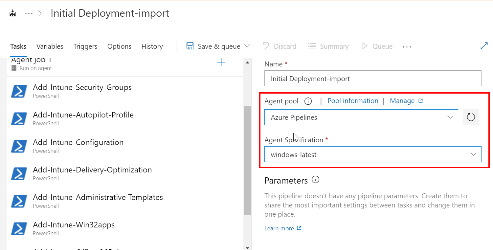
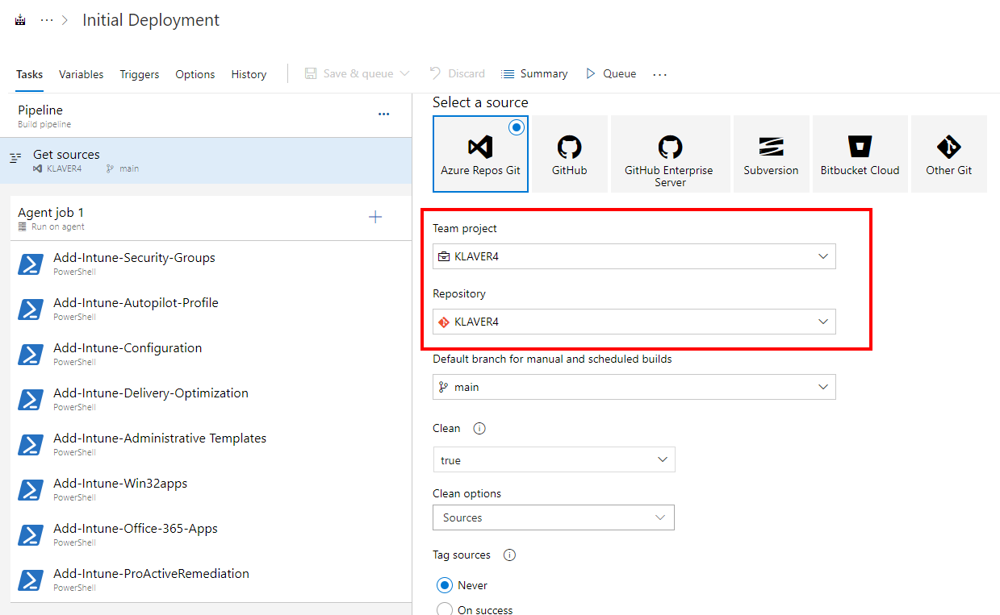
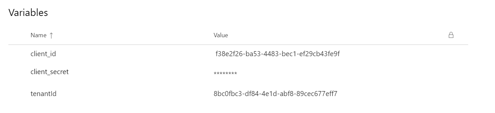
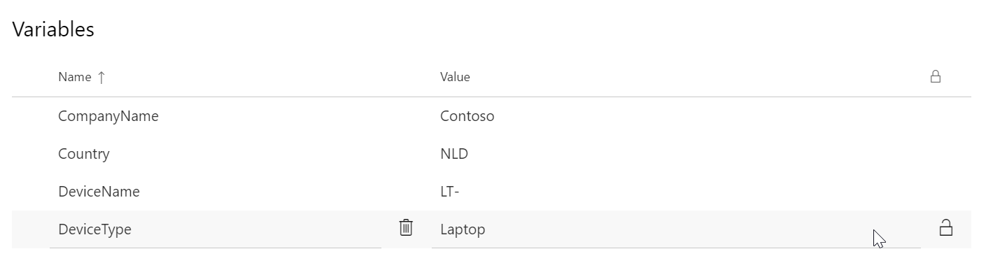
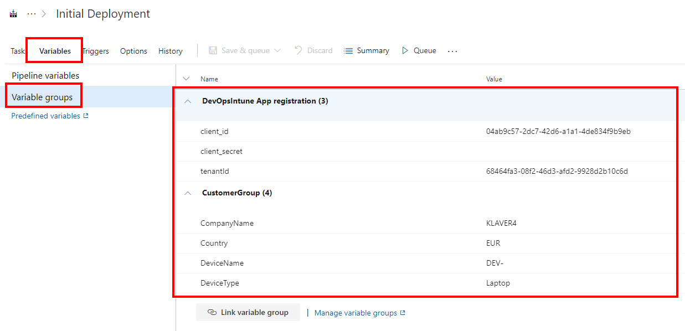

Import a DevOps pipeline
------------------------

To run a pipeline, first we have to create the pipeline.

*   Open [https://dev.azure.com/](https://dev.azure.com/dwswanalytics/)
    
*   Select the project
    
*   Select Pipelines
    
*   Click **…** (after Create Pipeline) and select Import Pipeline
    
*   Browse to the Pipeline file (JSON file) and click Open.
    

*   Click on **Import**
    
*   In DevOps, select **Azure Pipelines** as Agent Pool and **Windows-latest** as Agent Specification
    

*   Click **Get sources**
    
*   Select the **Team Project** and **Repository**
    

*   Click Save & queue
    
*   Click **Save**
    

Add App Registration Variable groups
------------------------------------

*   Select **Library**
    
*   Click **\+ Variable Group**
    
*   Type **DevOpsIntune App registration** as **Variable Group name**
    
*   Type a Description (optional)
    
*   Click **+Add**
    
*   Add the following Variables:
    

<table data-layout="default" data-local-id="b5592a02-e229-4f12-a7a6-4e4e6f0cdec3" class="confluenceTable"><colgroup><col style="width: 340.0px;"><col style="width: 340.0px;"></colgroup><tbody><tr><th class="confluenceTh">
<strong>Name</strong>
</th><th class="confluenceTh">
<strong>Value</strong>
</th></tr><tr><td class="confluenceTd">
tenantId
</td><td class="confluenceTd">
[Directory (tenant) ID
</td></tr><tr><td class="confluenceTd">
client_id
</td><td class="confluenceTd">
[Application (client) ID
</td></tr><tr><td class="confluenceTd">
client_secret
</td><td class="confluenceTd">
Secret value
</td></tr></tbody></table>

*   Insert the tenantID
    
*   Insert the cliend\_id
    
*   Insert the client\_secret
    

*   Click on **Save**
    

  
Add Customer Variable Group
------------------------------

*   Select **Library**
    
*   Click **\+ Variable Group**
    
*   Type **CustomerGroup** as **Variable Group name**
    
*   Type a Description (optional)
    
*   Click **+Add**
    
*   Add the following Variables:
    

<table data-layout="default" data-local-id="0caa5698-0e14-4cbc-92a8-f49ab8027b32" class="confluenceTable"><colgroup><col style="width: 340.0px;"><col style="width: 340.0px;"></colgroup><tbody><tr><th class="confluenceTh">
<strong>Name</strong>
</th><th class="confluenceTh">
<strong>Value</strong>
</th></tr><tr><td class="confluenceTd">
CompanyName
</td><td class="confluenceTd">
Example: Orange
</td></tr><tr><td class="confluenceTd">
Country
</td><td class="confluenceTd">
Example: NLD
</td></tr><tr><td class="confluenceTd">
DeviceName
</td><td class="confluenceTd">
Example: LT- for laptops, or KIOSK- for Kiosk devices
</td></tr><tr><td class="confluenceTd">
DeviceType
</td><td class="confluenceTd">
Example: Laptop
</td></tr></tbody></table>

*   Insert the Company Name
    
*   Insert the Country or Region
    
*   Insert the DeviceName used for Autopilot enrollment
    
*   Insert the DeviceType
    

*   Click on **Save**
    

Link the variable groups to the pipeline
----------------------------------------

*   Open [https://dev.azure.com/](https://dev.azure.com/dwswanalytics/)
    
*   Select the project
    
*   Select Pipelines
    
*   Click **Edit** the Pipeline
    
*   Click **Variables**
    
*   Click **Variable Groups**
    
*   Click **Link variable group**
    
*   Select **DevOpsIntune App registration** and click **Link**
    
*   Click **Link variable group**
    
*   Select **CustomerGroup** and click **Link**
    
*   Click Save & queue
    
*   Click **Save**
    

