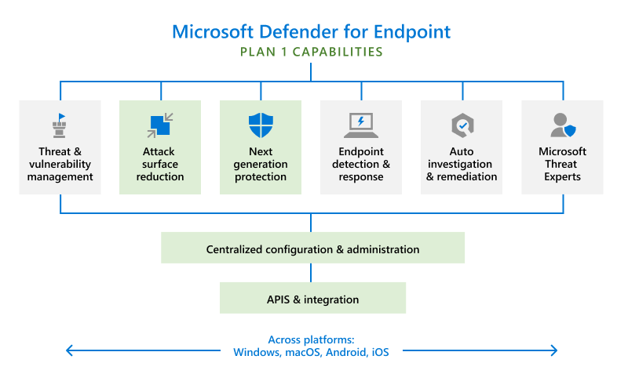

Microsoft Defender for Endpoint is an enterprise endpoint security platform designed to help organizations like yours to prevent, detect, investigate, and respond to advanced threats. We are pleased to announce that Defender for Endpoint is now available in two plans:

*   Defender for Endpoint Plan 1
    
*   Defender for Endpoint Plan 2
    

The green boxes in the following image depict what's included in Defender for Endpoint Plan 1:

Defender for Endpoint Plan 1 capabilities
-----------------------------------------

Defender for Endpoint Plan 1 includes the following capabilities:

*   Next generation protection that includes industry-leading, robust antimalware and antivirus protection
    
*   Manual response action, such as sending a file to quarantine, that your security team can take on devices or files when threats are detected
    
*   Attack surface reduction capabilities that harden devices, prevent zero-day attacks, and offer granular control over endpoint access and behaviors
    
*   Centralized configuration and management with the Microsoft 365 Defender portal and integration with Microsoft Endpoint Manager
    
*   Protection for a variety of platforms including Windows, macOS, iOS, and Android devices
    

<table data-layout="default" data-local-id="42a408eb-d7ea-4a09-96ce-d6c63dc82c95" class="confluenceTable"><colgroup><col style="width: 80.0px;"><col style="width: 307.0px;"><col style="width: 372.0px;"></colgroup><tbody><tr><th class="confluenceTh">
<strong>#</strong>
</th><th class="confluenceTh">
<strong>Decision</strong>
</th><th class="confluenceTh">
<strong>Justification</strong>
</th></tr><tr><td class="confluenceTd">

</td><td class="confluenceTd">
Microsoft Defender for Endpoint plan 1 will be used to secure the Windows devices.
</td><td class="confluenceTd">
Microsoft Defender for Endpoint plan 2 needs a different more expensive license. Microsoft Defender for Endpoint plan 1 will be de default for the cloud managed device.
</td></tr><tr><td class="confluenceTd">

</td><td class="confluenceTd">
Windows devices will be automatically enrolled into Microsoft Defender for Endpoint plan 1
</td><td class="confluenceTd">
Windows devices will be automatically be enrolled and monitored by Microsoft Defender for Endpoint.
</td></tr></tbody></table>