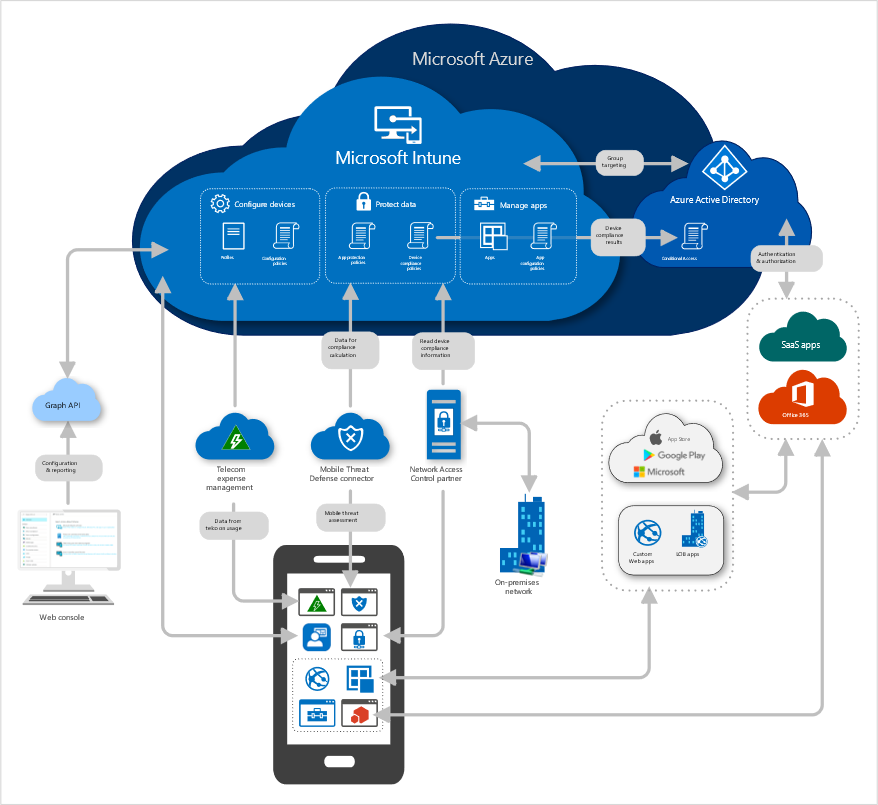

Microsoft Intune is a cloud-based service that focuses on mobile device management (MDM) and mobile application management (MAM). You control how your organization’s devices are used, including mobile phones, tablets, and laptops. You can also configure specific policies to control applications. For example, you can prevent emails from being sent to people outside your organization. Intune also allows people in your organization to use their personal devices for school or work. On personal devices, Intune helps make sure your organization's data stays protected and can isolate organization data from personal data.

Intune is part of Microsoft's Enterprise Mobility + Security (EMS) suite. Intune integrates with Azure Active Directory (Azure AD) to control who has access and what they can access. It also integrates with Azure Information Protection for data protection. It can be used with the Microsoft 365 suite of products. For example, you can deploy Microsoft Teams, OneNote, and other Microsoft 365 apps to devices. This feature enables people in your organization to be productive on all of their devices while keeping your organization’s information protected with the policies you create.

Overview Microsoft Intune services:

With Intune, you can:

*   Choose to be 100% cloud with Intune, or be co-managed with Configuration Manager and Intune.
    
*   Set rules and configure settings on personal and organization-owned devices to access data and networks.
    
*   Deploy and authenticate apps on devices -- on-premises and mobile.
    
*   Protect your company information by controlling the way users access and share information.
    
*   Be sure devices and apps are compliant with your security requirements.