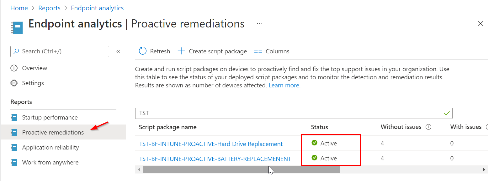

Proactive remediations are script packages that can detect and fix common support issues on a user's device before they even realize there's a problem. These remediations can help reduce support calls. Each script package consists of a detection script, a remediation script, and metadata. Through Intune, you can deploy these script packages and see reports on their effectiveness.

<table data-layout="default" data-local-id="42a408eb-d7ea-4a09-96ce-d6c63dc82c95" class="confluenceTable"><colgroup><col style="width: 80.0px;"><col style="width: 307.0px;"><col style="width: 372.0px;"></colgroup><tbody><tr><th class="confluenceTh">
<strong>#</strong>
</th><th class="confluenceTh">
<strong>Decision</strong>
</th><th class="confluenceTh">
<strong>Justification</strong>
</th></tr><tr><td class="confluenceTd">

</td><td class="confluenceTd">
A proactive remediation scripted will be added to remove the Quick assist app.
</td><td class="confluenceTd">
A scipt will be added to remove the default Windows quick assist app.
</td></tr></tbody></table>