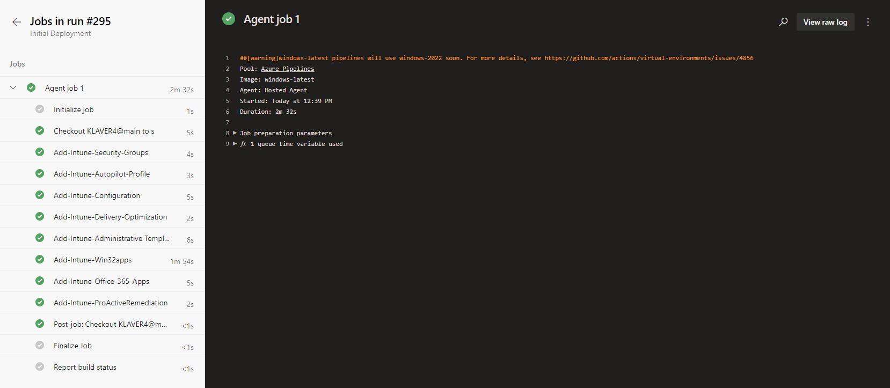

*   Open [https://dev.azure.com/](https://dev.azure.com/dwswanalytics/)
    
*   Click on your organization
    
*   Click on your DevOps project
    
*   Click **Pipelines**
    
*   Click the pipeline
    
*   Click **Run pipeline**
    
*   Click **Run**
    

