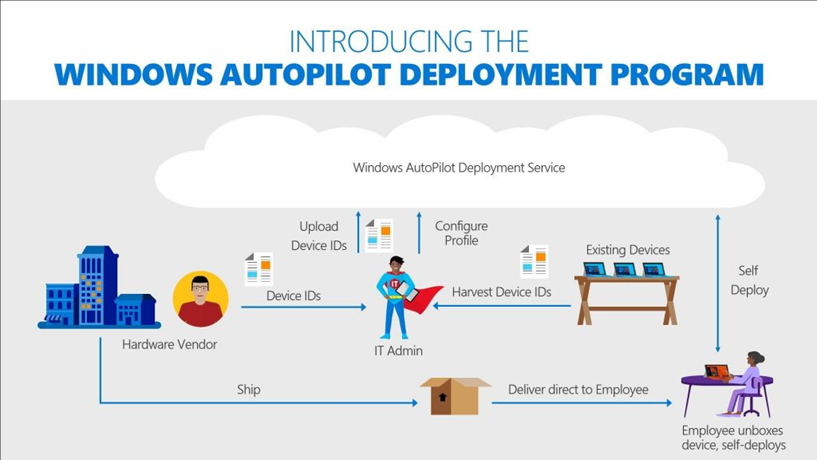

Windows Autopilot is a collection of technologies that are used to set up and pre-configure new Windows devices so that they are ready for use by end users quickly. In addition, Windows Autopilot can be used to reset, re-use, or restore Windows devices.

The Windows Autopilot capability organizations can achieve capability described above with little to no infrastructure to manage through an Auto Pilot process this simplifies the process for both the end user and IT administrator.

The devices need to be registered in the Autopilot deployment program, this can be done automatically via an authorized vendor who purchased Windows devices and uploads the relevant information into the Intune web-portal of the organization. After registration, the Windows devices are fully configured without the need for additional actions by the end users.

The Windows Auto Pilot deployment program is capable to automate the following processes:

*   Add Windows devices to Azure Active Directory;
    
*   Automatically enroll the device into the Intune MDM solution;
    
*   Remove the administrator privileges for the end users (if necessary);
    
*   Automatic assign Windows devices to a specific configuration group;
    
*   A couple of lite adjustments to the Out-Of-The-Box experience.
    

From the moment the end users unboxed the device, only the following steps are required during the OOBE.

*   Selecting a preferred language and keyboard layout.
    
*   Connect to a (WIFI) network.
    
*   Enter the primary e-mail address (Azure AD account) and password.
    

Multiple additional configuring setting can be skipped during the enrollment process because of the device is automatically recognized as belonging to an organization. After this process, the device is connected to Azure Active Directory and enrolled in Microsoft Intune. The MDM enrollment ensures that the predefined policy is applied, apps are installed, and settings are configured on the device. Windows update for business applies the latest updates to ensure that the device is up to date.

Windows Autopilot can also provide a white glove service that enables partners or IT staff to pre-provision a Windows 10 device so that it is fully configured and business-ready. From the end user’s perspective, the Windows Autopilot user-driven experience is unchanged, but getting their device to a fully provisioned state is faster.

<table data-layout="default" data-local-id="42a408eb-d7ea-4a09-96ce-d6c63dc82c95" class="confluenceTable"><colgroup><col style="width: 77.0px;"><col style="width: 329.0px;"><col style="width: 354.0px;"></colgroup><tbody><tr><th class="confluenceTh">
<strong>#</strong>
</th><th class="confluenceTh">
<strong>Decision</strong>
</th><th class="confluenceTh">
<strong>Justification</strong>
</th></tr><tr><td class="confluenceTd">
DD05
</td><td class="confluenceTd">
MFA authentication is required during the Windows Autopilot enrollment process
</td><td class="confluenceTd">
To enroll a device in Intune, a second authentication method must be validated to enroll the device.
</td></tr><tr><td class="confluenceTd">
DD06
</td><td class="confluenceTd">
Autopilot with White Glove can be used to speed up the Autopilot enrollment for the end user.
</td><td class="confluenceTd">
Autopilot with White Glove can be used to enroll and install corporate apps or applications during the Autopilot device setup and reseal the device after enrolling and installing the corporate apps or applications.
</td></tr><tr><td class="confluenceTd">
DD07
</td><td class="confluenceTd">
The latest Windows build will be used to build and deploy.
</td><td class="confluenceTd">
The latest Windows build will be used for building, testing en enrolling a device in Intune.
</td></tr><tr><td class="confluenceTd">
DD08
</td><td class="confluenceTd">
End User License Agreement (EULA), Cortana, OneDrive, privacy settings and OEM registration setup pages will be skipped.
</td><td class="confluenceTd">
End users will <strong><u>not </u></strong>be asked questions about License Agreements, Cortana, OneDrive or privacy settings. These questions must be skipped to create a Zero touch deployment.
</td></tr><tr><td class="confluenceTd">
DD09
</td><td class="confluenceTd">
The sign in experience of the company will shown with the company branding. Instead of presenting a generic Azure Active Directory sign-in page, all devices registered with Autopilot will automatically present a customized sign-in page with the company name, logo, and additional help text, as configured in Azure Active Directory.
</td><td class="confluenceTd">
The end user will be shown the company branding sign in page to enroll the device.
</td></tr><tr><td class="confluenceTd">
DD10
</td><td class="confluenceTd">
Users will be standard users on the device when enrolled with Windows.
</td><td class="confluenceTd">
Users will be a standard user meaning they will not have administrative permissions on the corporate device.
</td></tr></tbody></table>