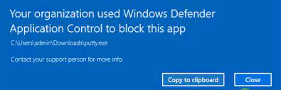

With thousands of new malicious files created every day, using traditional methods such as antivirus solutions is an insufficient defense against new attacks. Windows Defender Application Control makes sure that apps are trusted unless they are blocked by an antivirus or other security solution. By using the "Code Integrity policy" of Windows Defender Application Control, it determines which applications are considered trusted.

Windows Defender Application Control can be configured in two modes:

1.  **Enforcement enabled** - Only trusted executables are allowed to run.
    
2.  **Audit only** - Allow all executables to run, but log untrusted executables that run in the local client event log.
    

<table data-layout="default" data-local-id="42a408eb-d7ea-4a09-96ce-d6c63dc82c95" class="confluenceTable"><colgroup><col style="width: 80.0px;"><col style="width: 307.0px;"><col style="width: 372.0px;"></colgroup><tbody><tr><th class="confluenceTh">
<strong>#</strong>
</th><th class="confluenceTh">
<strong>Decision</strong>
</th><th class="confluenceTh">
<strong>Justification</strong>
</th></tr><tr><td class="confluenceTd">

</td><td class="confluenceTd">
Windows Defender Application Control will be configured as Audit only. WDAC will <u>not be</u> configure as Enforcement enabled option.
</td><td class="confluenceTd">
We do not want to block any not assigned application from running. If all business apps and applications are known, this setting can be changed to Enforcement enabled, but be careful because it can block apps or applications from running.
</td></tr></tbody></table>