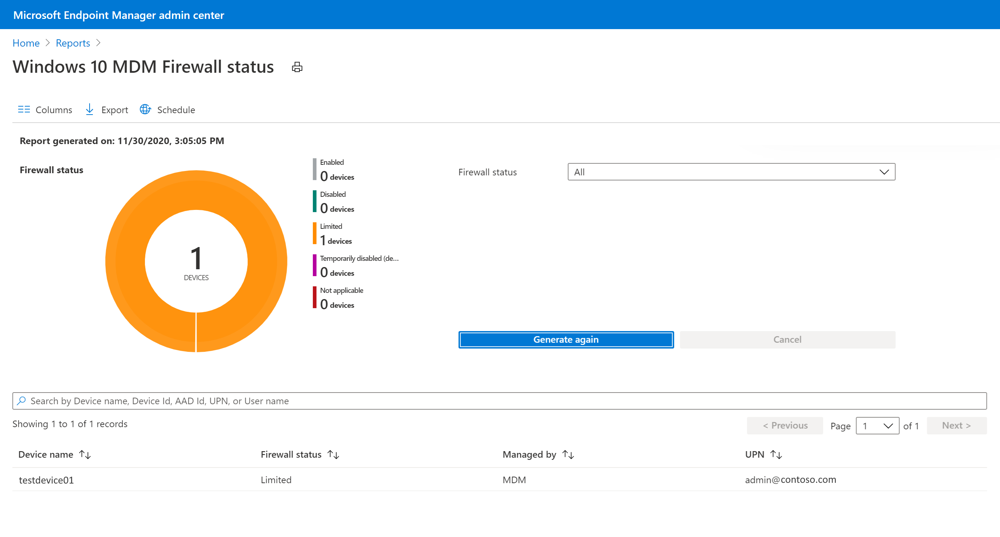

If we’re managing your devices using Microsoft Intune, you may want to control your Windows Defender Firewall policy. A firewall controls what network traffic is allowed and not allowed to pass through ports. For regular devices like laptops and desktops, the firewall should allow little inbound traffic. There is rarely any legitimate reason for other devices to connect to your device, or home network, unsolicited. Therefore, it's important to have Microsoft Defender Firewall switched on to protect your device from unauthorized access.

Picture of Devices firewall status,  
  
Tip#  
Microsoft defender Firewall settings are also applied in combination with Microsoft security baseline.

<table data-layout="default" data-local-id="48f62fbc-b94b-47bd-9a13-51790662fae5" class="confluenceTable"><colgroup><col style="width: 82.0px;"><col style="width: 297.0px;"><col style="width: 380.0px;"></colgroup><tbody><tr><th class="confluenceTh">
<strong>#</strong>
</th><th class="confluenceTh">
<strong>Decision</strong>
</th><th class="confluenceTh">
<strong>Justification</strong>
</th></tr><tr><td class="confluenceTd">
&nbsp;
</td><td class="confluenceTd">
Microsoft Firewall will be enabled for private and public profiles
</td><td class="confluenceTd">
Every device gets the configuration settings that the Windows firewall will be enabled.
</td></tr></tbody></table>